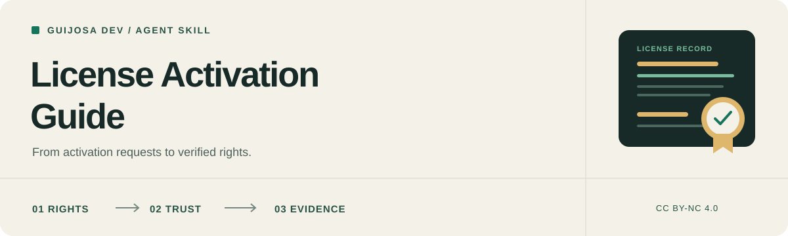

<p align="center">
  
</p>

<h1 align="center">License Activation Guide</h1>

<p align="center">
  <a href="CHANGELOG.md"></a>
  <a href="LICENSE"></a>
  <a href="CONTRIBUTING.md"></a>
  <a href="tests/skill.test.mjs"></a>
</p>

<p align="center"><a href="README.md" lang="es">Español</a> | <strong>English</strong></p>

<p align="center">
  Instructions for an agent to design, implement or audit software licensing,<br>
  trace activation through its actual effects and verify its decisions.
</p>

<p align="center">
  <strong>Online | Offline | LAN | Rust and other languages</strong><br>
  Self-contained skill | On-demand references | CC BY-NC 4.0
</p>

<p align="center">
  <a href="#why-it-exists">Why it exists</a> |
  <a href="#what-it-reviews">What it reviews</a> |
  <a href="#installation">Installation</a> |
  <a href="#usage">Usage</a> |
  <a href="#architecture">Architecture</a> |
  <a href="#validation">Validation</a> |
  <a href="#contributing">Contributing</a> |
  <a href="#license-and-commercial-use">License</a>
</p>

---

> [!IMPORTANT]
> **Read [the complete skill](skill-license-activate/SKILL.md) before installing it.** It guides an agent with your environment's tools and permissions. It does not include a licensing server, enforce a security boundary or guarantee model compliance. The installable instructions are written in Spanish.

## Why it exists

An activation key is not verified entitlement. A valid signature may belong to another product or device. Concurrent requests may consume the last seat. Retrying after a lost response should not create another activation or restart the commercial term.

This skill collects design and review lessons into general guidance. It separates issuance, verification, policy, identity, persistence and enforcement. It identifies decisions to resolve before coding and evidence to obtain before delivery.

The guide **does not publish a specific product's implementation**: names and scenarios are generic, without secrets, endpoints, internal thresholds, original fixtures or an operational map of the source project.

Its scope is commercial software licensing. It does not replace legal analysis of contracts or dependency licenses, and ordinary authentication work does not automatically become a general security audit. It has not been shown to equalize different models' capabilities.

## What it reviews

| Area | Questions applied to design and code |
| --- | --- |
| **Commercial rules** | What consumes a seat? When does the term start? Do reinstallations and renewals preserve history? |
| **Authority and signatures** | Who issues rights? What context is authenticated? Does the client receive only public trust? |
| **Activation and seats** | Do retries recover results? Do transitions withstand concurrency and partial failures? |
| **Online and offline** | Does disconnection retain only current verified rights? Are offline revocation limits explained? |
| **State and recovery** | Is success reported after persistence? Are identity recreation, revision rollback and evidence loss avoided? |
| **Permissions and isolation** | Are actor, action, tenant, license and device checked at every actual entry point? |
| **LAN and platform** | Are service and IPC authenticated? Are effective identities and permissions tested? |
| **Resources and files** | Is API, signer and import work bounded before side effects? |
| **Testing and delivery** | Are permitted cases and rejection without effects tested? Is local evidence separate from production? |

Apply sections within the task's scope. Rust and Windows have a dedicated reference; other languages retain the invariants and adapt their mechanisms. A key hierarchy, TPM or separate service is not required for every project.

## How it works

1. **Defines the task.** Audit, design, implementation, diagnosis or change review.
2. **Reads environment and policy.** Commercial unit, connectivity, actors, platform and existing contracts.
3. **Traces the operation.** Credential, intent, authority, document, persistence, decision and actual effect.
4. **Acts within scope.** Preserves other changes and does not invent commercial rights or support privileges.
5. **Tests outcomes and failures.** Permitted use, rejection, concurrency and recovery for the affected boundary.
6. **Reports evidence.** Findings or changes, results, limitations and pending checks.

## Installation

### Skills CLI

From this local repository's root, list detected skills without installing:

```bash
pnpm dlx skills add . --list
```

From your target project, replace the quoted path with this repository's location:

```bash
pnpm dlx skills add "<local-repository-path>" --skill skill-license-activate
```

Once the content is published on [GitHub](https://github.com/elpeakyblinder/skill-license-activate), install from the repository:

```bash
pnpm dlx skills add elpeakyblinder/skill-license-activate --skill skill-license-activate
```

The [Skills CLI](https://github.com/vercel-labs/skills) accepts local paths and remote repositories. [PUBLICAR.md](PUBLICAR.md) covers distribution checks. Installation does not change the material's license.

### Manual installation

Copy the entire inner **`skill-license-activate/` folder**, including `SKILL.md`, `LICENSE`, `agents/` and `references/`, into your agent's supported directory. The outer folder is repository presentation, not the installable package.

| Agent | Example project destination | Documentation |
| --- | --- | --- |
| Codex | `.agents/skills/skill-license-activate/` | [Skills](https://learn.chatgpt.com/docs/build-skills) |
| Claude Code | `.claude/skills/skill-license-activate/` | [Skills](https://code.claude.com/docs/en/skills) |
| Google Antigravity | `.agents/skills/skill-license-activate/` | [Skills](https://antigravity.google/docs/skills) |
| Cursor | `.cursor/skills/skill-license-activate/` | [Skills](https://cursor.com/docs/skills) |

Paths were checked against official documentation on **October 8, 2026**. This does not prove correct execution in every agent or model. Verify discovery and the loaded file in your version; avoid conflicting copies with the same name. Reading the package requires no MCP server, source project or runtime dependency.

## Usage

### Audit without edits

```text
Use skill-license-activate to audit activation, seats and recovery.
Do not modify files or data. Trace operations and alternate entry points,
report evidence-backed findings and propose tests. Separate observations
from checks that require another environment.
```

### Design or implement

```text
Use skill-license-activate to implement licensing in this project.
Preserve its language and architecture. Resolve pending commercial
decisions before fixing the contract. You may edit code and run isolated
synthetic tests within the requested scope. Verify permissions, retries
and partial failures. Do not use live data.
```

### Diagnose a failure

```text
Use skill-license-activate to investigate an activation lost after a
timeout and restart. Trace the intent and its durable result. Correct
the demonstrated cause without recreating identity or granting another
seat. Preserve business data and test recovery.
```

Installing or invoking the skill does not grant additional authority to issue commercial licenses, migrate live data, rotate keys, deploy or change infrastructure. An audit does not automatically authorize implementation.

## Architecture

```text
.
|-- README.md / README.en.md
|-- LICENSE / VERSION / CHANGELOG.md
|-- CONTRIBUTING.md / SECURITY.md / PUBLICAR.md
|-- .github/                    Issue and PR templates
|-- assets/                     Localized SVG banners
|-- examples/                   Synthetic Spanish and English scenarios
|-- tests/skill.test.mjs         Package maintenance
`-- skill-license-activate/     Folder to install
    |-- SKILL.md
    |-- LICENSE
    |-- agents/openai.yaml
    `-- references/
        |-- architecture.md
        |-- protocol-and-trust.md
        |-- lifecycle-and-recovery.md
        |-- rust-and-windows.md
        `-- validation.md
```

The canonical source is [SKILL.md](skill-license-activate/SKILL.md). Load only the references required by the task:

- [Architecture and policy](skill-license-activate/references/architecture.md)
- [Protocol and trust](skill-license-activate/references/protocol-and-trust.md)
- [Lifecycle and recovery](skill-license-activate/references/lifecycle-and-recovery.md)
- [Rust and Windows](skill-license-activate/references/rust-and-windows.md)
- [Behavioral validation](skill-license-activate/references/validation.md)

The installable folder retains its license and notices when copied alone. Repository governance documents and examples are not instruction dependencies.

## Study scenarios

| Synthetic scenario | Español | English |
| --- | --- | --- |
| Last seat, timeout and retry | [Activación concurrente](examples/activacion-concurrente.md) | [Concurrent activation](examples/concurrent-activation.md) |
| Offline import and recovery | [Recuperación offline](examples/recuperacion-offline.md) | [Offline recovery](examples/offline-recovery.md) |

These are proposed reproductions illustrating decisions and tests. **They are not certified real cases or results from running an implementation included in this repository.**

## Validation

The repository includes **8 maintenance tests** for self-contained packaging, references, licenses, versions, banners, governance and absence of private source markers:

```bash
node --test tests/skill.test.mjs
```

They ran on Node.js 24. These checks validate the package; they do not implement licensing or demonstrate model compliance. Signature, seat, service and persistence tests described in the guide must run in the project using it.

## Contributing

Contributions in Spanish and English are welcome. Read [CONTRIBUTING.md](CONTRIBUTING.md) and the templates for [problems](.github/ISSUE_TEMPLATE/bug_report.md), [proposals](.github/ISSUE_TEMPLATE/proposal.md) and [PRs](.github/pull_request_template.md). Once published, use the repository's [Issues](https://github.com/elpeakyblinder/skill-license-activate/issues) for reports without sensitive information.

Use [SECURITY.md](SECURITY.md) when a report could expose real systems, keys or private information. Do not include full conversations, production fixtures or secrets.

Contributors retain authorship. Inclusion under the public license does not automatically grant additional commercial rights; agree those separately with the rights holders.

## Versions and languages

The prepared local version is **0.1.0**, recorded in [VERSION](VERSION) and [CHANGELOG.md](CHANGELOG.md). No remote release is claimed. Version numbers identify content, not certification of security or copy resistance.

README documentation is available in Spanish and English. Installable instructions remain in Spanish; translating the presentation does not establish independent evaluation in other languages or agents.

## License and commercial use

**© 2026 Guijosa Dev.** Original skill text, documentation and SVG artwork are offered under **[Creative Commons Attribution-NonCommercial 4.0 International](https://creativecommons.org/licenses/by-nc/4.0/)**. Read the [full license](LICENSE).

You may share and adapt the material for noncommercial purposes under the license: retain applicable attribution and notices, link the license and indicate changes. Granted permissions are not revoked while its conditions are met.

**Commercial use requires separate permission**, except where applicable law permits use without authorization. Contact **[devcharlying@gmail.com](mailto:devcharlying@gmail.com?subject=Commercial%20permission%20-%20License%20Activation%20Guide)** with who will use it, the intended purpose and whether it will be redistributed or incorporated into a service. There is no automatic fee or revenue-sharing arrangement.

Noncommercial status depends on the purpose of the use; a free application or the absence of resale does not by itself settle that question. Clarify uncertain business or paid uses before adopting the material.

The license concerns copyrightable repository material. It does not claim ownership of your projects, general ideas or licensing techniques, and it does not automatically make every agent output the author's property. Third-party materials retain their own terms. This project is not presented as open-source software without commercial restrictions.

Suggested attribution, adapted to the medium:

> License Activation Guide by Guijosa Dev (2026). [CC BY-NC 4.0](https://creativecommons.org/licenses/by-nc/4.0/). Source: [original repository](https://github.com/elpeakyblinder/skill-license-activate). Changes: identify modifications, if any. Provided without warranties; retain the applicable disclaimer notice.

---

## Disclaimer

This skill was created by **Guijosa Dev** from personal experience reviewing projects and working with AI agents. It is shared as guidance. **Read and understand its instructions before use** and assess their suitability for your project, model, tools and environment.

The material is provided **as is and as available, without warranties**, to the maximum extent permitted by applicable law. It does not guarantee freedom from vulnerabilities, protection against attacks, regulatory compliance, accurate results or fitness for a particular purpose. It is not a professional security or legal service, audit or certification.

Models may misinterpret instructions, omit checks or perform inappropriate actions. Review changes and results, limit agent permissions and use isolated tests and backups appropriate to the risk. Do not test third-party systems without authorization.

**The person or organization using this skill is responsible, within their scope of action and control, for evaluating and deciding how it is used.** This includes selecting and configuring the agent, limiting its permissions, reviewing recommendations, validating proposed optimizations and changes, and deciding what to authorize, execute or deploy. Delegating work to an AI agent does not replace professional judgment or supervision. This statement does not automatically assign all legal liability to the user or exclude non-excludable liabilities of the author or third parties.

To the maximum extent permitted by applicable law, the author and contributors disclaim liability for damages or losses arising from use of, or inability to use, this material, including data loss, service interruption, security failures or consequences of actions performed by AI agents. **This exclusion does not apply where prohibited by law** and does not remove rights or liabilities that cannot legally be excluded.

This notice accompanies the license without changing its terms or imposing additional restrictions on rights it grants. Nothing in this repository guarantees legal immunity for its author, contributors or users. This English documentation does not amend the official license text.
