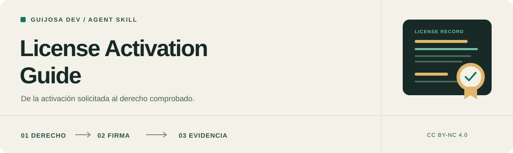

<p align="center">
  
</p>

<h1 align="center">License Activation Guide</h1>

<p align="center">
  <a href="CHANGELOG.md"></a>
  <a href="LICENSE"></a>
  <a href="CONTRIBUTING.md"></a>
  <a href="tests/skill.test.mjs"></a>
</p>

<p align="center"><strong>Español</strong> | <a href="README.en.md" lang="en">English</a></p>

<p align="center">
  Instrucciones para que un agente diseñe, implemente o audite licenciamiento,<br>
  siga los efectos reales de la activación y compruebe sus decisiones.
</p>

<p align="center">
  <strong>Online | Offline | LAN | Rust y otros lenguajes</strong><br>
  Skill autocontenida | Referencias bajo demanda | CC BY-NC 4.0
</p>

<p align="center">
  <a href="#por-qué-existe">Por qué existe</a> |
  <a href="#qué-revisa">Qué revisa</a> |
  <a href="#instalación">Instalación</a> |
  <a href="#cómo-usarla">Uso</a> |
  <a href="#arquitectura">Arquitectura</a> |
  <a href="#validación">Validación</a> |
  <a href="#aportaciones">Contribuir</a> |
  <a href="#licencia-y-uso-comercial">Licencia</a>
</p>

---

> [!IMPORTANT]
> **Lee [la skill completa](skill-license-activate/SKILL.md) antes de instalarla.** Es material orientativo para un agente con las herramientas y permisos de tu entorno. No incorpora un servidor de licencias, impone una barrera de seguridad ni garantiza que el modelo siga todas las instrucciones.

## Por qué existe

Una clave de activación no equivale a derechos verificados. Una firma válida puede pertenecer a otro producto o dispositivo. Dos solicitudes concurrentes pueden consumir el último cupo. Un reintento tras perder una respuesta no debería crear otra activación ni reiniciar la vigencia comercial.

Esta skill reúne lecciones de diseño y revisión en una guía general. Separa emisión, verificación, política, identidad, persistencia y aplicación de permisos. Explica decisiones que un agente debe resolver antes de programar y evidencia que debe obtener al entregar.

La guía **no publica la implementación de un producto concreto**: los nombres y escenarios son genéricos, sin secretos, endpoints, umbrales internos, fixtures originales ni un mapa operativo del proyecto de origen.

Sirve para licenciamiento comercial de software. No sustituye análisis jurídico de contratos o licencias de dependencias, ni convierte un cambio ordinario de autenticación en una auditoría general. No se ha demostrado que iguale las capacidades de distintos modelos.

## Qué revisa

| Área | Preguntas que lleva al diseño y al código |
| --- | --- |
| **Reglas comerciales** | ¿Qué se cuenta? ¿Cuándo empieza la vigencia? ¿Reinstalar o renovar conserva la historia? |
| **Autoridad y firmas** | ¿Quién emite? ¿Qué contexto autentica el documento? ¿El cliente solo recibe confianza pública? |
| **Activación y cupos** | ¿Los reintentos recuperan resultados? ¿Las transiciones resisten concurrencia y fallos parciales? |
| **Online y offline** | ¿La desconexión conserva únicamente derechos vigentes? ¿Se explican los límites de revocación offline? |
| **Estado y recuperación** | ¿Se confirma después de persistir? ¿Se evita recrear identidad, bajar revisiones o perder evidencia? |
| **Permisos y aislamiento** | ¿Se comprueban actor, acción, cliente, licencia y equipo en cada entrada real? |
| **LAN y plataforma** | ¿El servicio y el IPC están autenticados? ¿Se prueban identidad y permisos efectivos? |
| **Consumo y archivos** | ¿Se acota el trabajo de API, signer e importación antes de sus efectos? |
| **Pruebas y entrega** | ¿Se comprueban casos permitidos y denegación sin efectos? ¿La evidencia local se distingue de producción? |

Los apartados se aplican según la tarea. Rust y Windows tienen una referencia propia; los demás lenguajes conservan las invariantes y adaptan sus mecanismos. No exige una jerarquía de claves, TPM o servicio separado en todos los proyectos.

## Cómo trabaja

1. **Delimita el trabajo.** Auditoría, diseño, implementación, diagnóstico o revisión de un cambio.
2. **Reconoce el entorno y la política.** Unidad comercial, conectividad, actores, plataforma y contratos vigentes.
3. **Traza la operación.** Credencial, intento, autoridad, documento, persistencia, decisión y efecto real.
4. **Actúa dentro del alcance.** Conserva cambios ajenos y no inventa derechos comerciales ni permisos de soporte.
5. **Prueba ambos lados y los fallos.** Caso autorizado, denegación, concurrencia y recuperación según la frontera.
6. **Entrega evidencia.** Hallazgos o cambios, resultados, límites y verificaciones pendientes.

## Instalación

### Con el CLI de Skills

Desde la raíz de esta copia local, consulta la detección sin instalar:

```bash
pnpm dlx skills add . --list
```

Para instalar desde tu proyecto de destino, sustituye la ruta entre comillas por la ubicación de este repositorio:

```bash
pnpm dlx skills add "<ruta-local-del-repositorio>" --skill skill-license-activate
```

Cuando el contenido esté publicado en [GitHub](https://github.com/elpeakyblinder/skill-license-activate), instala desde el repositorio:

```bash
pnpm dlx skills add elpeakyblinder/skill-license-activate --skill skill-license-activate
```

El [CLI de Skills](https://github.com/vercel-labs/skills) admite rutas locales y repositorios remotos. [PUBLICAR.md](PUBLICAR.md) explica cómo comprobar la distribución. La instalación no cambia las condiciones de uso del material.

### Instalación manual

Copia la carpeta interior **`skill-license-activate/` completa**, incluyendo `SKILL.md`, `LICENSE`, `agents/` y `references/`, en el directorio admitido por tu agente. La carpeta exterior contiene la presentación del repositorio; no es el paquete instalable.

| Agente | Ejemplo de destino del paquete en un proyecto | Documentación |
| --- | --- | --- |
| Codex | `.agents/skills/skill-license-activate/` | [Skills](https://learn.chatgpt.com/docs/build-skills) |
| Claude Code | `.claude/skills/skill-license-activate/` | [Skills](https://code.claude.com/docs/en/skills) |
| Google Antigravity | `.agents/skills/skill-license-activate/` | [Skills](https://antigravity.google/docs/skills) |
| Cursor | `.cursor/skills/skill-license-activate/` | [Skills](https://cursor.com/docs/skills) |

Las rutas se contrastaron con documentación oficial el **8 de octubre de 2026**. Eso no demuestra ejecución correcta en cada agente o modelo. Comprueba su descubrimiento y el archivo cargado en tu versión; evita copias distintas con el mismo nombre. El paquete no depende de un servidor MCP, del proyecto del autor ni de un runtime para leer sus instrucciones.

## Cómo usarla

### Auditar sin modificar

```text
Usa skill-license-activate para auditar activación, cupos y recuperación.
No modifiques archivos ni datos. Traza las operaciones y sus entradas
alternativas, entrega hallazgos con evidencia y propone pruebas.
Distingue lo comprobado de lo que requiere otro entorno.
```

### Diseñar o implementar

```text
Usa skill-license-activate para implementar licenciamiento en este proyecto.
Conserva el lenguaje y la arquitectura existentes. Resuelve las decisiones
comerciales pendientes antes de fijar el contrato. Puedes editar código y
ejecutar pruebas sintéticas aisladas dentro del alcance solicitado.
Comprueba permisos, reintentos y fallos parciales. No uses datos reales.
```

### Diagnosticar un fallo

```text
Usa skill-license-activate para investigar una activación que se pierde
al reiniciar después de un timeout. Sigue el intento y su resultado
duradero. Corrige la causa comprobada sin recrear identidad ni conceder
otro cupo. Conserva los datos del negocio y prueba la recuperación.
```

Instalar o invocar la skill no concede autorización adicional para emitir licencias comerciales, migrar datos reales, rotar claves, desplegar ni modificar infraestructura. Una auditoría no se convierte automáticamente en implementación.

## Arquitectura

```text
.
|-- README.md / README.en.md
|-- LICENSE / VERSION / CHANGELOG.md
|-- CONTRIBUTING.md / SECURITY.md / PUBLICAR.md
|-- .github/                    Plantillas de issues y PR
|-- assets/                     Portadas SVG localizadas
|-- examples/                   Escenarios sintéticos en español e inglés
|-- tests/skill.test.mjs         Mantenimiento del paquete
`-- skill-license-activate/     Carpeta que se instala
    |-- SKILL.md
    |-- LICENSE
    |-- agents/openai.yaml
    `-- references/
        |-- architecture.md
        |-- protocol-and-trust.md
        |-- lifecycle-and-recovery.md
        |-- rust-and-windows.md
        `-- validation.md
```

La fuente principal es [SKILL.md](skill-license-activate/SKILL.md). Carga las referencias solo cuando sean necesarias:

- [Arquitectura y política](skill-license-activate/references/architecture.md)
- [Protocolo y confianza](skill-license-activate/references/protocol-and-trust.md)
- [Ciclo de vida y recuperación](skill-license-activate/references/lifecycle-and-recovery.md)
- [Rust y Windows](skill-license-activate/references/rust-and-windows.md)
- [Validación de comportamiento](skill-license-activate/references/validation.md)

La carpeta instalable conserva su licencia y avisos al copiarse por separado. Los documentos de mantenimiento y ejemplos del repositorio no son dependencias de sus instrucciones.

## Escenarios de estudio

| Escenario sintético | Español | English |
| --- | --- | --- |
| Último cupo, timeout y reintento | [Activación concurrente](examples/activacion-concurrente.md) | [Concurrent activation](examples/concurrent-activation.md) |
| Importación offline y recuperación | [Recuperación offline](examples/recuperacion-offline.md) | [Offline recovery](examples/offline-recovery.md) |

Son reproducciones propuestas para enseñar las decisiones y pruebas. **No son casos reales certificados ni resultados de ejecutar una implementación incluida en este repositorio.**

## Validación

El repositorio incluye **8 pruebas de mantenimiento** para verificar carpeta autocontenida, referencias, licencias, versiones, portadas, documentos y ausencia de marcadores privados:

```bash
node --test tests/skill.test.mjs
```

Se ejecutaron con Node.js 24. Estas comprobaciones validan el paquete, no implementan licenciamiento ni demuestran que un agente siga las instrucciones. Las pruebas de firmas, cupos, servicios y persistencia descritas en la guía deben ejecutarse en el proyecto donde se aplique.

## Aportaciones

Las contribuciones son bienvenidas en español e inglés. Lee [CONTRIBUTING.md](CONTRIBUTING.md) y las plantillas de [problemas](.github/ISSUE_TEMPLATE/bug_report.md), [propuestas](.github/ISSUE_TEMPLATE/proposal.md) y [PR](.github/pull_request_template.md). Una vez publicado, utiliza los [Issues](https://github.com/elpeakyblinder/skill-license-activate/issues) del repositorio para reportes sin información sensible.

Si el reporte expone un sistema real, claves o información privada, usa [SECURITY.md](SECURITY.md). No adjuntes conversaciones completas, fixtures productivos o secretos.

Conservas la autoría de tus aportaciones. Su incorporación bajo la licencia pública no concede automáticamente permisos comerciales adicionales; estos se acuerdan por separado con sus titulares.

## Versiones e idiomas

La versión local preparada es **0.1.0**, registrada en [VERSION](VERSION) y [CHANGELOG.md](CHANGELOG.md). No se afirma que exista una release remota. La versión identifica contenido, no una certificación de seguridad ni de resistencia a copia.

Los README están disponibles en español e inglés. La skill instalable permanece en español; la traducción de la presentación no acredita una evaluación independiente en otros idiomas o agentes.

## Licencia y uso comercial

**© 2026 Guijosa Dev.** El texto de la skill y la documentación original se ofrecen bajo **[Creative Commons Atribución-NoComercial 4.0 Internacional](https://creativecommons.org/licenses/by-nc/4.0/deed.es)**. La cabecera SVG original se ofrece bajo la misma licencia. Consulta el [texto completo](LICENSE) y su [versión oficial en español](https://creativecommons.org/licenses/by-nc/4.0/legalcode.es).

Puedes compartir y adaptar el material para fines no comerciales cumpliendo la licencia: conserva la atribución y los avisos aplicables, enlaza la licencia e indica los cambios. Los permisos concedidos no se revocan mientras se cumplan sus condiciones.

**El uso comercial requiere un permiso separado**, salvo los usos para los que la ley no exige autorización. Para plantear tu caso y negociar condiciones, escribe a **[devcharlying@gmail.com](mailto:devcharlying@gmail.com?subject=Permiso%20comercial%20-%20License%20Activation%20Guide)**. Incluye quién lo utilizará, para qué y si se redistribuirá o integrará en un servicio. No existe una tarifa ni un reparto de ingresos automático.

“No comercial” depende del propósito del uso; que una aplicación sea gratuita o que la skill no se revenda no basta para clasificarlo. Si tienes dudas sobre un uso empresarial o remunerado, acláralas antes de incorporarla.

Esta licencia se refiere al material protegible del repositorio; no reclama propiedad sobre tus proyectos, ideas generales o técnicas de licenciamiento. La restricción comercial no convierte automáticamente todo resultado de un agente en propiedad del autor. Los materiales de terceros conservan sus propios términos. Este proyecto no se presenta como software de código abierto sin restricciones comerciales.

Una forma de atribución que puedes adaptar al medio:

> License Activation Guide, de Guijosa Dev (2026). [CC BY-NC 4.0](https://creativecommons.org/licenses/by-nc/4.0/). Fuente: [repositorio original](https://github.com/elpeakyblinder/skill-license-activate). Cambios: indica los realizados, si los hay. Material sin garantías; conserva el aviso de responsabilidad aplicable.

---

## Aviso de responsabilidad

Esta skill fue creada por **Guijosa Dev** a partir de su experiencia personal revisando proyectos y trabajando con agentes de IA. Se comparte como material orientativo. **Lee y entiende sus instrucciones antes de utilizarla** y valora si son adecuadas para tu proyecto, modelo, herramientas y entorno.

El material se proporciona **tal cual y según disponibilidad, sin garantías**, en la máxima medida permitida por la ley aplicable. No garantiza ausencia de vulnerabilidades, protección frente a ataques, cumplimiento normativo, exactitud de los resultados ni idoneidad para un propósito concreto. Tampoco constituye una auditoría, certificación o asesoría profesional de seguridad o jurídica.

Los modelos pueden interpretar mal las instrucciones, omitir comprobaciones o ejecutar acciones inadecuadas. Revisa los cambios y resultados, limita los permisos del agente y utiliza pruebas aisladas y copias de seguridad según el riesgo. No ejecutes pruebas sobre sistemas ajenos sin autorización.

**La responsabilidad de evaluar y decidir cómo se utiliza esta skill corresponde a la persona u organización que la emplea, dentro de su ámbito de actuación y control.** Esto incluye seleccionar y configurar el agente, delimitar sus permisos, revisar sus recomendaciones, validar las optimizaciones y los cambios propuestos, y decidir cuáles autoriza, ejecuta o despliega. Delegar tareas a un agente de IA no sustituye el criterio profesional ni la supervisión de quien lo utiliza. Esta declaración no atribuye automáticamente toda responsabilidad jurídica al usuario ni excluye responsabilidades del autor o de terceros que la ley no permita excluir.

En la máxima medida permitida por la ley aplicable, el autor y los colaboradores excluyen su responsabilidad por daños o pérdidas derivados del uso o de la imposibilidad de uso de este material, incluidos pérdida de datos, interrupción de servicios, fallos de seguridad o consecuencias de acciones realizadas por agentes de IA. **Esta exclusión no se aplica cuando la ley no la permita** y no elimina derechos ni responsabilidades que no puedan excluirse legalmente.

Este aviso acompaña a la licencia y no modifica sus términos ni impone restricciones adicionales a los derechos que concede. Ningún aviso de este repositorio debe interpretarse como una garantía de inmunidad jurídica para su autor, colaboradores o usuarios.
